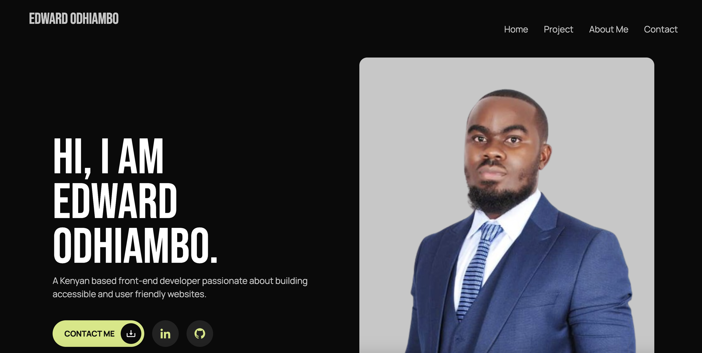

## Sneak Peek



# My Portfolio

## Description

> Welcome to my portfolio crafted with HTML and CSS! This platform serves as a showcase of my projects and expertise. Whether you're a recruiter or someone seeking my services, you can easily navigate to find my contact information and reach out. Explore my work and let's connect to bring your ideas to life!

## Live Demo Link

[Live Link]()

## Built With


## Get Started

### Run

```
To get a clone of the project, run `git clone https://github.com/odhiambo-ed/edward-portfolio-moringa.git`
```

```
cd /edward-portfolio-moringa
```
On your browser insert the link below
```
http://127.0.0.1:5501/index.html
```


## Author(s)

  <a href="https://github.com/odhiambo-ed" target="blank"></a>   **Edward Odhiambo**

- GitHub: [@whit3d](https://github.com/odhiambo-ed)
- Twitter: [@odhiambo_ed](https://twitter.com/odhiambo_ed)
- LinkedIn: [Edward Odhiambo](https://www.linkedin.com/in/edward-odhiambo/)
- Portfolio: [Edward Odhiambo](https://edwardodhiambo.com/)

## 🤝 Contributing

Contributions, issues, and feature requests are welcome!!!

Feel free to check the [issues page]https://github.com/odhiambo-ed/edward-portfolio-moringa/issues)

## Show your support

Give a ⭐️ if you like this project!

## Acknowledgments

- Hat tip to anyone whose code was used
- Special thanks to [Portfolio for Developers by Suman Kunwar](https://www.figma.com/community/file/1311309815091555685/portfolio-for-developers) for the amazing Figma design that served as the foundation for this project. Your creativity and attention to detail greatly contributed to its development. I am grateful for your talent and generosity in sharing your work with the community.

